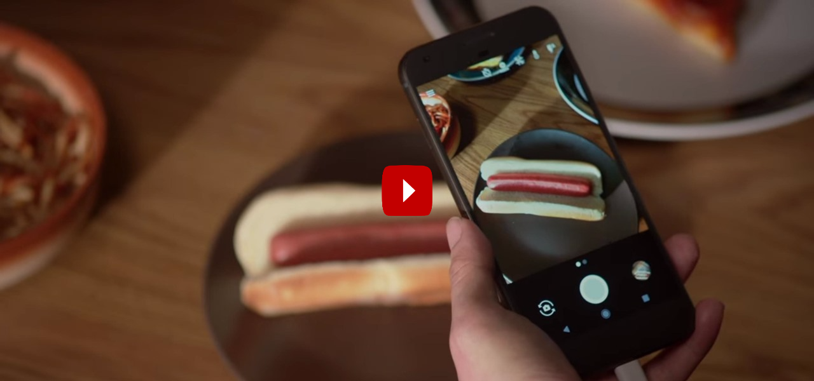

## Oh My Gos!
Created by **Stuart King**, November 2017

### Web App
Finally, the app you've been waiting for. [**Oh My Gos!**](http://ec2-52-90-188-86.compute-1.amazonaws.com:8105/) is a facial recognition tool that will provide you with the answer to the age-old question, "Is that Ryan Gosling?"

### Inspiration
Click the image to watch a clip from [Silicon Valley](http://www.imdb.com/title/tt2575988/)  
(Warning: Adult Content)
<!--  -->

### Disclaimer
Use with caution. Boyfriend analysis often leads to sadness and disappointment.

### Acknowledgements
[**Oh My Gos!**](http://ec2-52-90-188-86.compute-1.amazonaws.com:8105/) is made possible by [`face_recognition`](https://github.com/ageitgey/face_recognition), a facial recognition library built using  `dlib`'s state-of-the-art image recognition technology.
